# **Azure DevOps Project Environment and its Repositories**

## **What is Azure Devops?** 

Azure DevOps is a **Software as a service (SaaS)** platform from Microsoft that provides an end-to-end DevOps toolchain for developing and deploying softwares.  It also integrates with most leading tools on the market and is a great option for orchestrating a DevOps toolchain. [Visit Official Site](https://docs.microsoft.com/en-us/azure/devops/user-guide/what-is-azure-devops?view=azure-devops)

## **Azure DevOps Project Environment Setup** 

> ### **Step 1: CREATING AZURE DEVOPS ACCOUNT**
> 
> - Signup at Azure Devops from https://dev.azure.com/
> - You can login from your existing **Microsoft** or **Github** account
>
--------------------
> ### **Step 2: SETTING-UP AN ORGANIZATION** 
>
>#### **What is an Organization?**
>
>An **Organization** in Azure DevOps is a mechanism for organizing and connecting groups of related projects
>
>We can create an organization while sign-up or create mutiple organizations after the sign-up

>  
>:arrow_right: **While Signing-Up**

> 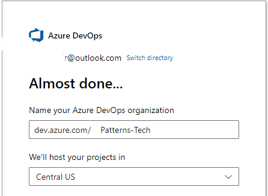
>
>:arrow_right: **After Signing-Up**
>
> **1:** Select ***New Organization*** 
> 
> 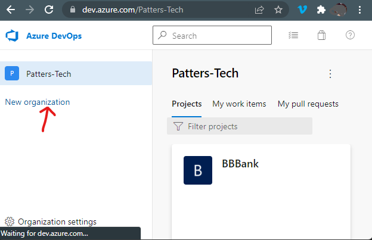
>
> **2:** Enter name of an organization and select **Continue**
> 
>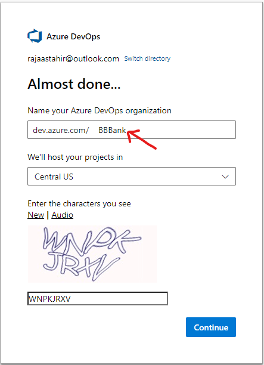
>
>*Congratulations!, organization is created successfully.* 
>Click [here](https://dev.azure.com/) to sign-in to an organization

-------------------------

> ## **Step 3: CREATING PROJECT IN AN ORGANIZATION**
>
>### **What is a Project in an Azure Organization?**
>
>Azure DevOps Project helps you ***launch an application*** on an Azure App Service of your choice in a few quick steps and set you up with everything you need for ***developing, deploying, and to monitoring*** your application
>
> Lets create a sample project for a bank 
>
>  1. Enter a name, description and select visiblity to your project and click **Create Project** 
> 
>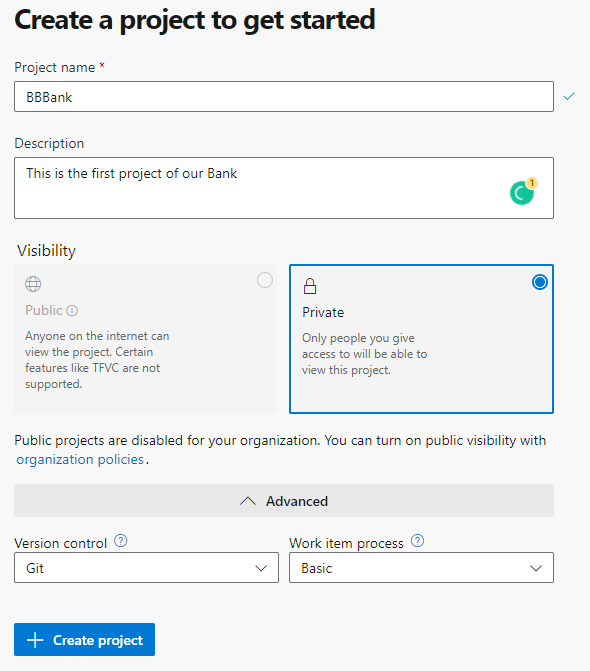
>
------------------
>
> ## **Step 4: Create a Repository in a Project**
> 
> ### **What is a Repository in Azure DevOps?**
>Azure DevOps repos are a set of repositories that ***allow you to version control and manage your project code***. It helps to work and coordinate code changes across your team.
>
>  We will create two repositories in our project, one for ***front-end code*** and the other for the ***back-end code***
>
>Click on **New Repository** from the Repos tab
>
> 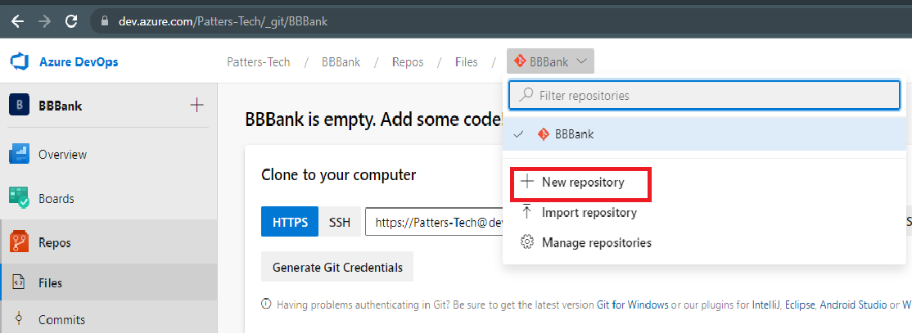
>
>We will name this repo **BBBank_UI** and click **Create**
> 
> 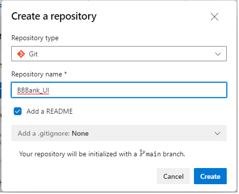
>
> :arrow_right: Project environment is created successfully!
> 
-------------------------------------

## **2) Interacting with repositories **

 ### **What is a Git?**

GitHub is a code hosting platform for version control and collaboration. It lets you and others work together on projects from anywhere

:arrow_right: Follow below steps to clone git repositories. 

> ### **Step 1: Git Installation**
>
>Click [here](https://gitforwindows.org/) to download the git

-----------------
> ### **Step 2: Cloning Git Repository from the Command Line Interface (CLI)**
> 1. Create a folder for the project
> 2. Create a sub-folder for UI project (*BBBank_UI*)
> 
> 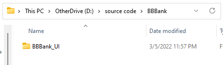
>
> 3. Right Click in the folder and open the PowerShell Terminal
> 
>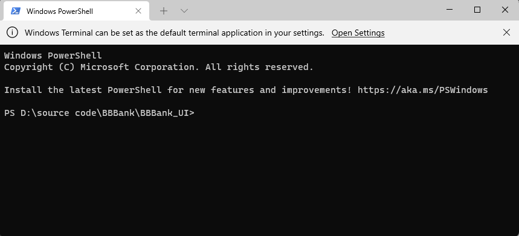  
> 
> 4. Go to the Azure Devops portal and **select Repos** from the side-bar menu and **copy the repository URL**
> 
>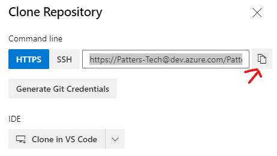
>
>5. Use the following command to clone the repository. 
>
> ```bash
> git clone <Paste the URL here>
>  ```
------------
> ## **Step 3: Create a Local branch**
> 
>  ### **What is a Branch in Git?**
>
> A branch is a **unique set of code changes** with a unique name. Each repository can have one or more branches. The main branch — the one where all **changes eventually get merged** back into, and is called master. Branches allow us to develop features, fix bugs, and we can safely experiment with new ideas in a contained area of your repository. 
>
> :arrow_right: Use the following command in the CLI to create a your branch
>
>```powershell
> git checkout -b ＜your branch name＞
>```
>
>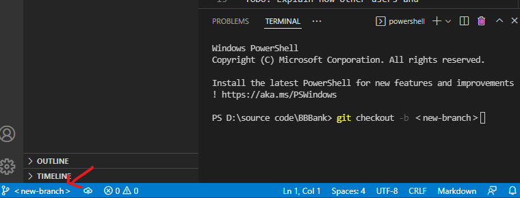

----------------

> ### **Step 4: Create a simple HTML Page**
> 1. Open Visual Studio Code and** create HTML file** by file clicking on the 'File' and **selecting 'New File'** option and name it *index.html*
> 
>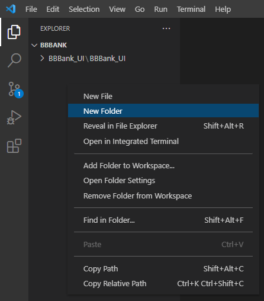
>
>2. Add some HTML code 

>```html
><h1>This is my first page</h1>
>```
>3. Save the file and you can see *index.html* file in folder where you created the repository.

>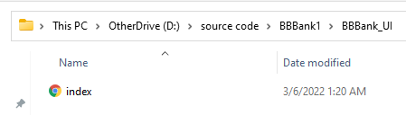

----------------------

> ### **Step 5: Stage Changes** 
> 
>Staging the files is simply to prepare it finally for a commit. A staging step in git **allows you to continue making changes to the working directory**, and when you decide you wanna interact with version control, it **allows you to record changes in small commits**. Git, with its index allows you to commit only certain parts of the changes you've done since the last commit.
>
> :arrow_right: Run the following command in CLI to **stage all the files**
>
> ```powershell
> git add .
>```
----------------
>### **Step 6: Check the Git Status**

> :arrow_right: Run the following command to **check the git status.** The current status of our folder is showing that **changes are stagged** but **not Commited** yet
>
>```powershell
>git status
>```
> 
>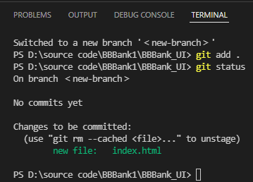
>
-------------------
>### **Step 7: Commiting Changes**

> 
In version control systems, a commit is an operation which s**ends the latest changes of the source code to the repository**. Commits are snapshots of your entire repository at specific time. You should make new commits often, based around logical units of change. 
>
>Over time, commits should tell a story of the history of your repository and how it came to be the way that it currently is. Commits include lots of metadata in addition to the contents and message, like the author, timestamp, and more. 
>
>:arrow_right: Run the following command to commit your changes
>
>```powershell
>git commit -m yourmessage
>```
>here *-m* represents the message about the code that we have commited. It is easy for us to see what changings has been made in the commit.

------------------------------
>### **Step 8: Pushing Changes to Server**
>
>The git **push command allows us to send the committed files to the remote repository** from our branch in local Git repository .
>
>:arrow_right: Run the following command in the CLI to push code
>
>```powershell
>git push --all
>```
>You can **see your files in the Azure DevOps portal repository** after the push command.
>
> 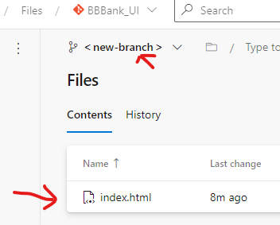
 -------------------------------

 >## **NOTE** 
 > You need to **configured your username and email-id** in a Git. Otherwise you may see errors while pushing the commits. 
 >
 > :arrow_right: **Follow these steps if you face error while pushing**
 >
 >Run the following command in the CLI **to check the configuration** 

 >```powershell
 >git config --golbal --list
 >```
 >Run the following command **if you don't have the configuration set** for your username and email 

 >```powershell
 > git config --global user.name "username"
 > git config --global user.email "your email"
 >```
 >
 >**Test the configurtion** by followng the process from step 1, once the above command succeeds

----------------------------

 >### **Step 9: Pull from Repository**
 >The git pull command is used to **fetch and download content from a remote repository** and immediately update the local repository to match that content. Merging remote upstream changes into your local repository is a common task in Git-based collaboration work flows.
 >
 >Run the following command to **pull from the remote repository**
 >
 >```powershell
 >git pull --all
 >```

## **Suggestions**
------------------------
:arrow_right: Read more about [git commads](https://git-scm.com/docs)
:arrow_right: Read more about [Azure DevOps]((https://docs.microsoft.com/en-us/azure/devops/user-guide/what-is-azure-devops?view=azure-devops))
:arrow_right: Read more about [Visual Studio](https://devblogs.microsoft.com/visualstudio/)
