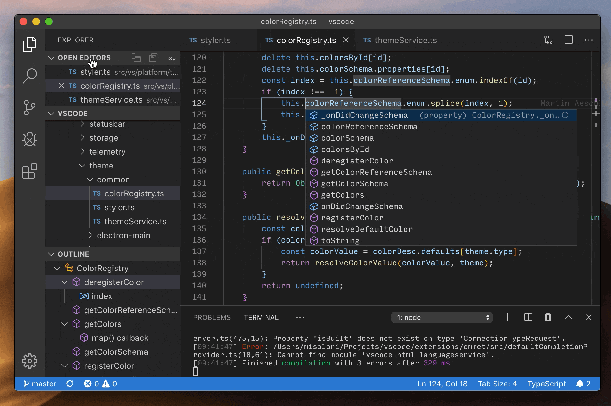

# Setting repositories in Azure DevOps & Interacting it with Git

## What is Azure Devops? 

Azure DevOps is a Software as a service (SaaS) platform from Microsoft that provides an end-to-end DevOps toolchain for developing and deploying software.  It also integrates with most leading tools on the market and is a great option for orchestrating a DevOps toolchain. [Read More](https://docs.microsoft.com/en-us/azure/devops/user-guide/what-is-azure-devops?view=azure-devops)

> **STEP 1: CREATING AZURE DEVOPS ACCOUNT**
> 
> - Login at Azure Devops from https://dev.azure.com/
> - Click on **START FREE** to login from your existing Microsoft Account
> 
> 
>   OR
> 
> - Click on **Start free with GitHub** to login from existing github account
> 

## What is Organization in Azure DevOps?

Organization is just like setting up a new company. Use an organization to connect groups of related projects, and help to scale up your enterprise.
> **STEP 2: SETTING-UP ORGANIZATION**
> 
> 1. Sign into [Azure DevOps](https://dev.azure.com/)
>
> 2. Select **New Organization**
> 
>
>
> 3. Confirm information/name of your organization, and thn select **Countinue**
>
> 
>
>Congratulations, you're an organization owner!
>Sign in to your organization at any time, https://dev.azure.com/{yourorganization}

## What is Project in an Azure Organization?

A project provides a repository for source code and a place for users to plan, track progress, and collaborate on building software solutions. A project represents a fundamental container where data is stored when added to Azure DevOps.

> **STEP 3: CREATING PROJECT**
>
>  1. Give a logical name to your project and click **Create Project** 
>
> 
>
> 2. After creating the project you manage all project related tasks from left side pannel 
> 
> 
>

## What are Repositories?

Azure Repos is a set of version control tools that you can use to manage your code.

> **STEP 5: CREATING REPOSITORIES IN AZURE DEVOPS**
>
> 1. Click **Repos** from left side of your Azure panel
>
> 
>
>2. Now the next step is to Clone repostory to editor or Import Existing Repository
> > There are 3 ways to start working on your repos
>> - Copy the Link and Paste it into your code editor 
>> OR
>> Directly add existing repos to your code editor from this tab to start working on this repository
>> 
>>OR
>> - Copy this and Push and existing repository from Git CLI
>> 
>>OR
>>- Copy link from existing GitHub repository. Import directly from there
>> 

## What is Clone? 

Cloning a repo downloads all commits and branches in the repo. Cloning sets up a named relationship with the existing repo you cloned

> **STEP 6: CLONE REPOSITORY FROM AZURE TO CODE EDITOR (VSCODE)** 
> 
>1. You can clone your blank repos either by following previous step 
>OR
>Start using existing repository and Click on **CLONE** from upper right corner 
>
> 
>
>2. Select the repository location where the code will be saved in your local PC
>
> 
>
>3. It will ask you to Enter your Microsoft account credentials so Code Editor will have access to interact with Azure Devops
>
>
>
>4. Now you are ready to make changes in the code!
>
>
