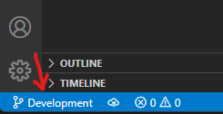
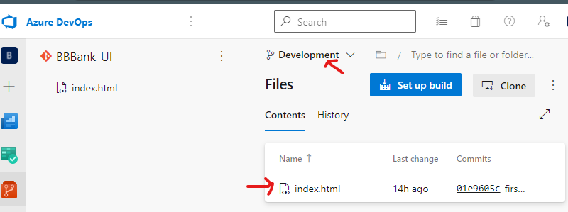

# Setting up Project environment in Azure DevOps & interacting with its repositories

## 1) Setting up Project environment in Azure DevOps

### What is Azure Devops? 

Azure DevOps is a Software as a service (SaaS) platform from Microsoft that provides an end-to-end DevOps toolchain for developing and deploying software.  It also integrates with most leading tools on the market and is a great option for orchestrating a DevOps toolchain. [Read More](https://docs.microsoft.com/en-us/azure/devops/user-guide/what-is-azure-devops?view=azure-devops)

> ### **STEP 1: CREATING AZURE DEVOPS ACCOUNT**
> 
> - Signup at Azure Devops from https://dev.azure.com/
> - Select **START FREE** to login from your existing Microsoft Account OR  **Start free with GitHub** to login from existing github account
>
--------------------
> ### **STEP 2: SETTING-UP AN ORGANIZATION** 
>
>### What is Organization in Azure DevOps?
>
>Organization is logical grouping of related projects, and help to scale up your enterprise.
>
>
> -> There are 2 ways of creating an organization in Azure DevOps
>  
> 1. While signing-up you will be asked to create new organization
> 
>
>  OR
>
> 1. If you already have organization, Sign into [Azure DevOps](https://dev.azure.com/)
>
> 2. Select **New Organization**
> 
>
>
> 3. Confirm information/name of your organization, and thn select **Countinue**
>
> 
>
>Congratulations, you're an organization owner!
>Sign in to your organization at any time, https://dev.azure.com/{yourorganization}


-------------------------


> ### **STEP 3: CREATING PROJECT IN ORGANIZATION**
>
>### What is Project in an Azure Organization?
>
>A project provides a repository for source code and a place for users to plan, track progress, and collaborate on building software solutions. A project represents a fundamental container where data is stored when added to Azure DevOps.
>
> -> We are making project for a bank (*BBBank*)
>
>  1. Give a logical name to your project and click **Create Project** 
>
> 
>
------------------
>
> ### **STEP 4: CREATING REPOSITORIES IN A PROJECT**
>Azure Repos is a set of version control tools that you can use to manage your code.
>
>  -> In this project we will 2 repositories
> 
> - One for UI
> - One for API Code
>
> Let's create one of these as a part of this lab
>Click on **New Repositories** from the Repos tab
>
> 
>
>We will name this repo **BBBank_UI** and click **Create**
> 
> 
>
> -> WE HAVE SUCCESSFULLY CREATED A PROJECT ENVIORNMENT!
>
> -> NOW WE WILL MOVE ON TO SECOND PART OF OUR LAB
--------------------------------------
-------------------------------------

## 2) INTERACTING WITH REPOSITORIES

> ### **STEP 1: Git and Installing git**
>
>Git is a free and open source distributed version control system. [Learn more](https://www.nobledesktop.com/learn/git/what-is-git)
>
> - Navigate to the latest [Git for Windows installer](https://gitforwindows.org/) and download the latest version.
-----------------
> ### **STEP 2: Cloning Git repository in from CLI**
>
> 1. First we will create folder in local computer for the project
> 2. We will create another sub-folder for UI project (*BBBank_UI*)
> 
>
> 3. Right Click in the folder and open the PowerShell Terminal
>  
> 
> 4. To clone our repository we will first copy the **Clone URL** from Azure Devops Portal
>
>
>5. Add copied URL after **git clone** and Run this command in the terminal
>
> ```bash
> git clone https://Patters-Tech@dev.azure.com/Patters-Tech/BBBank/_git/BBBank_UI
>  ```
------------
> ### **STEP 3: Create a Local branch**
>
> Branches allow you to develop features, fix bugs, or safely experiment with new ideas in a contained area of your repository. It is good practice to create a branch and start working on it rather than making changes to Main branch.
>
> -> To create a local branch run this command in Code Editor terminal
>
>```powershell
> git checkout -b ＜new-branch＞
>```
> -> New branch is successfully created 
>

----------------

> ### **STEP 4: Open VSCODE(Code Editor) and create HTML file**
>
>1. Right click and create file with the name *index.html*
>
>
>2. Now we will create a sample page by putting this HTML code.
>```html
><h1>This is my first page</h1>
>```
>.
----------------------

> ### **STEP 5: Staging Changes** 
>To stage a file is simply to prepare it finely for a commit. Git, with its index allows you to commit only certain parts of the changes you've done since the last commit.
>
> -> Run this command in terminal to stage all changes
>
> ```powershell
> git add .
>```
>.
----------------
>### **STEP 6: Check the Git Status**
> To check the status we will use this command
>
>```powershell
>git status
>```
> The current status of our folder is showing that changes are **Stagged** but not **Commited** yet
>
>
-------------------
>### **STEP 7: Commiting Changes**
> A commit, or "revision", is an individual change to a file (or set of files). 
>
>To commit our chnages we will use
>
>```powershell
>git commit -m firstcommit
>```
>here *-m* shows the message showing what we have commited

------------------------------
>### **STEP 8: Pushing Changes to Server**
>
>The git push command allows you to send (or push) the commits from your local branch in your local Git repository to the remote repository.
>
>To push to local server we use this command in terminal
>
>```powershell
>git push --all
>```
>-> Now if you goto your Azure DevOps portal you will see that all your changes are pushed into server successfully.
>And you can see our newly created index.html file in local branch *(new-branch)* in Azure Devops repository.
>
> 
 -------------------------------

 >### **NOTE: :warning: ERROR WHILE PUSHING** 
 > Those who have recently installed git may face some unforeseen error.
 > Possible cause of it is that your **username** and **email-id** is not configured in git. 
 >
 > If you face this error use commands below
 > 
 >```powershell
 > git config --global user.name "username"
 > git config --golbal user.email "your email id"
 >```
 >To check the configuration run
 >
 >```powershell
 >git config --golbal --list
 >```
 >.
----------------------------
 >### **STEP 9: Pull from repository**
 >Pull requests let you tell others about changes you've pushed to a branch in a repository on GitHub. Once a pull request is opened, you can discuss and review the potential changes with collaborators and add follow-up commits before your changes are merged into the base branch.
 >
 >To pull from the repository in which changes have been made, run this command
 >
 >```powershell
 >git pull --all
 >```
 >.

----------------------
------------------------
Read more about [git commads](https://git-scm.com/docs)


If you want to start using [Visual Studio Blog](https://devblogs.microsoft.com/visualstudio/)
