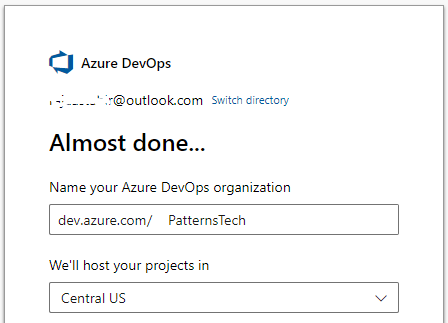

# Setting repositories in Azure DevOps & Interacting it with Git

## What is Azure Devops? 

Azure DevOps is a Software as a service (SaaS) platform from Microsoft that provides an end-to-end DevOps toolchain for developing and deploying software.  It also integrates with most leading tools on the market and is a great option for orchestrating a DevOps toolchain. [Read More](https://docs.microsoft.com/en-us/azure/devops/user-guide/what-is-azure-devops?view=azure-devops)

> ## STEP 1: CREATING AZURE DEVOPS ACCOUNT
> 
> - Login at Azure Devops from https://dev.azure.com/
> - Click on **START FREE** to login from your existing Microsoft Account
> 
> 
>   OR
> 
> - Click on **Start free with GitHub** to login from existing github account
> 

## What is Organization in Azure DevOps?

Organization is just like setting up a new company. Use an organization to connect groups of related projects, and help to scale up your enterprise.

> ## STEP 2: SETTING-UP ORGANIZATION
> 
> 1. Sign into [Azure DevOps](https://dev.azure.com/)
>
> 2. Select **New Organization**
> 
>
>
> 3. Confirm information/name of your organization, and thn select **Countinue**
>
> 
>
>Congratulations, you're an organization owner!
>Sign in to your organization at any time, https://dev.azure.com/{yourorganization}

## What is Project in an Azure Organization?

A project provides a repository for source code and a place for users to plan, track progress, and collaborate on building software solutions. A project represents a fundamental container where data is stored when added to Azure DevOps.

> ## STEP 3: CREATING PROJECT
>
>  1. Give a logical name to your project and click **Create Project** 
>
> 
>
> 2. After creating the project you manage all project related tasks from left side pannel 
> 
> 
>

> ## STEP 4: INSTALLING GIT ON WINDOWS
> 1. Navigate to the latest [Git for Windows installer](https://gitforwindows.org/) and download the latest version.
>
>2. Once the installer has started, follow the instructions as provided in the Git >Setup wizard screen until the installation is complete.
>
>3. Open the windows command prompt (or Git Bash if you selected not to use the standard Git Windows Command Prompt during the Git installation).
>
> 4. Type git version to verify Git was installed.
>
> NOTE: For information to install git on different OS, [click here](https://github.com/git-guides/install-git#:~:text=To%20install%20Git%2C%20run%20the,installation%20by%20typing%3A%20git%20version%20.)

## What are Repositories?

Azure Repos is a set of version control tools that you can use to manage your code.

> ## STEP 5: CREATING REPOSITORIES IN AZURE DEVOPS
>
> 1. Click **Repos** from left side of your Azure panel
>
> 
>
>2. Now the next step is to Clone repostory to editor or Import Existing Repository
> > There are 3 ways to start working on your repos
>> - Copy the Link and Paste it into your code editor 
>> OR
>> Directly add existing repos to your code editor from this tab to start working on this repository
>> 
>>OR
>> - Copy this and Push and existing repository from Git CLI
>> 
>>OR
>>- Copy link from existing GitHub repository. Import directly from there
>> 

## What is Clone? 

Cloning a repo downloads all commits and branches in the repo. Cloning sets up a named relationship with the existing repo you cloned

> ## STEP 6: CLONE REPOSITORY FROM AZURE TO CODE EDITOR (VSCODE) 
> 
>1. You can clone your blank repos either by following previous step 
>OR
>Start using existing repository and Click on **CLONE** from upper right corner 
>
> 
>
>2. Select the repository location where the code will be saved in your local PC
>
> 
>
>3. It will ask you to Enter your Microsoft account credentials so Code Editor will have access to interact with Azure Devops
>
>
>
>4. Now you are ready to make changes in the code!
>
>

>## STEP 7: CREATING LOCAL BRANCH
> Branches allow you to develop features, fix bugs, or safely experiment with new ideas in a contained area of your repository. It is good practice to create a branch and start working on it rather than making changes to Main branch.
> There are 2 ways to create Local branch:
>> 1. In your Azure devOps repository Click on Main section and create new branch
>>
>> 
>>
>>OR
>>
>> 2. Directly go to your code editor to creat new branch
>>
>> 

> ## STEP 8: STAGGING AND COMMITING
> 
>To stage a file is simply to prepare it finely for a commit. Git, with its index allows you to commit only certain parts of the changes you've done since the last commit.
> 1. First we **SAVE** whatever the data we have changed
> 2. We **Stage** all the changes by right clicking on **Changes** and select **Stage All Changes**
> 
>
>
>3. To commit all Staged,from source control panel click on the upper 3 dots **...**, select **Commit** and then **Commit Staged**. Write a commit message and press Enter.
>
> 
>
> This will directly Push and Pull to the Local branch you created in Azure Devops.
>
> 4. You can see your changes in local branch in DevOps Portal.

> ## STEP 9: PUSH AND PULL REQUEST
> 1. Select the branch you have created from azure portal
>
> 
>
>2. Create Pull request
>
>
>
>3. Select from origion and destination branches. Write the title and description.
>
>
>
>4. You can assign a reviewer, apply tags and assign work item from Azure boards. After completing the task click **Create**
>
>
>
> 5. **Approve** the changes you have made and Click **Complete**
>
>
>
> This will commit all Your changes to Main branch and will delete the local branch. 
